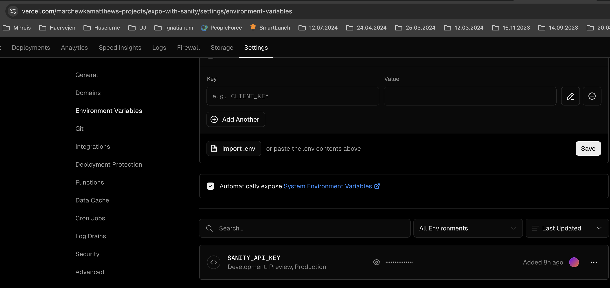

# Expo with Sanity example

## Description (GPT 4.0)

This PoC demonstrates how to integrate Sanity CMS into a mobile application without requiring a separate back-end server. The core goal is to access Sanity CMS directly from the mobile app repository using expo build-in API routes in a secure manner, without embedding sensitive API keys or secrets in the app code, which solves the issue of exposing sensitive data in the client-side environment.

## Problem (GPT 4.0)

Normally, mobile apps need a back-end server to interact securely with content management systems (CMS) like Sanity, because directly storing CMS credentials in the app risks exposing them to potential misuse. This PoC outlines an approach where the need for a separate back-end server is eliminated while keeping the sensitive information secure.

## References

- [API Routes documentation](https://docs.expo.dev/router/reference/api-routes/)
- [YouTube video instructions](https://www.youtube.com/watch?v=2P0q1EdH_oQ)

## Instructions

1. Initialize the repo with expo router
2. Apple the patch from this repository to the @expo/server until it's fixed
   > Without the patch hosting the API on Vercel is not working
3. Initialize the API route
4. Setup Vercel as described in the documentation
5. Add the `.env` file with the development environment variables
   > REMARK: Env variables shouldn't start with `EXPO_PUBLIC` unless you want them bundled with the app **(and visible in the plain-text compiled application)**
6. Deploy the app to Vercel
7. Set the production environment variables in the Vercel dashboard
   
8. Setup Sanity and add secret keys to .env and Vercel dashboard

## Example API route

`https://expo-with-sanity-ieazarzom-marchewkamatthews-projects.vercel.app/api/hello`
